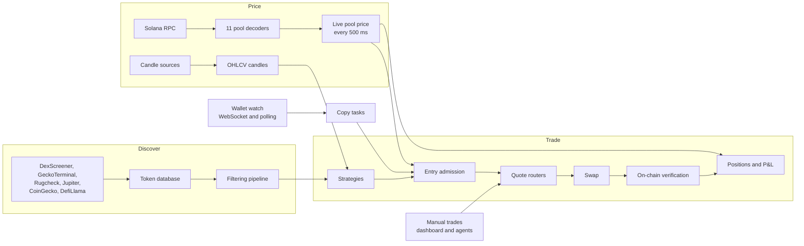

<p align="center">
  
</p>

<h1 align="center">ScreenerBot</h1>

<p align="center">
  <strong>Self-hosted Solana trading bot: token screener, auto trader and wallet copy trading, built in Rust.</strong>
</p>

<p align="center">
  <a href="https://github.com/farfary/ScreenerBot/releases/latest"></a>
  <a href="https://github.com/farfary/ScreenerBot/actions/workflows/build.yml"></a>
  <a href="LICENSE"></a>
  <a href="rust-toolchain.toml"></a>
  <a href="https://screenerbot.io/download"></a>
  <a href="https://screenerbot.io/docs"></a>
  <a href="https://t.me/screenerbotio_talk"></a>
</p>

<p align="center">
  <a href="https://screenerbot.io/download">Download</a> ·
  <a href="https://screenerbot.io/docs">Documentation</a> ·
  <a href="#quick-start">Quick start</a> ·
  <a href="#features">Features</a> ·
  <a href="https://t.me/screenerbotio_talk">Community</a>
</p>

ScreenerBot finds new Solana tokens, filters out risky ones with deterministic rules, prices them
straight from on-chain pool reserves every 500 ms, and trades them with your own strategies. It can
also copy the wallets you choose, starting in paper mode. Run it as a desktop app on macOS, Windows or
Linux, or headless on a VPS. Your wallet key is encrypted on your machine and never leaves it. There
is no subscription and no telemetry.

> [!WARNING]
> Trading cryptocurrency carries a substantial risk of loss. This software can contain bugs that lose
> money. You use it at your own risk, and the authors are not responsible for any losses. Start small,
> use paper mode where it exists, and never trade more than you can afford to lose.

---

## Contents

- [Screenshots](#screenshots)
- [Features](#features)
- [Quick start](#quick-start)
- [How it works](#how-it-works)
- [Discovery and filtering](#discovery-and-filtering)
- [Pricing and supported DEXs](#pricing-and-supported-dexs)
- [Strategies and the auto trader](#strategies-and-the-auto-trader)
- [Wallet copy trading](#wallet-copy-trading)
- [Swaps](#swaps)
- [AI assistant and MCP agent connections](#ai-assistant-and-mcp-agent-connections)
- [Dashboard and Telegram](#dashboard-and-telegram)
- [Security and privacy](#security-and-privacy)
- [Configuration](#configuration)
- [Data sources and RPC](#data-sources-and-rpc)
- [Building from source](#building-from-source)
- [Project structure](#project-structure)
- [Contributing](#contributing)
- [Community](#community)
- [License](#license)

---

## Screenshots

<table>
  <tr>
    <td align="center" width="33%"><strong>Dashboard</strong></td>
    <td align="center" width="33%"><strong>Copy Trading</strong></td>
    <td align="center" width="33%"><strong>Token Details</strong></td>
  </tr>
  <tr>
    <td><a href="https://screenerbot.io/api/screenshots/current/home?full=1"></a></td>
    <td><a href="https://screenerbot.io/api/screenshots/current/auto-trader-copy-trading?full=1"></a></td>
    <td><a href="https://screenerbot.io/api/screenshots/current/token-details?full=1"></a></td>
  </tr>
  <tr>
    <td align="center" width="33%"><strong>Strategy Builder</strong></td>
    <td align="center" width="33%"><strong>Strategy Conditions</strong></td>
    <td align="center" width="33%"><strong>Auto Trader</strong></td>
  </tr>
  <tr>
    <td><a href="https://screenerbot.io/api/screenshots/current/strategies-manage?full=1"></a></td>
    <td><a href="https://screenerbot.io/api/screenshots/current/strategies-conditions?full=1"></a></td>
    <td><a href="https://screenerbot.io/api/screenshots/current/trader?full=1"></a></td>
  </tr>
  <tr>
    <td align="center" width="33%"><strong>Open Positions</strong></td>
    <td align="center" width="33%"><strong>Token Discovery</strong></td>
    <td align="center" width="33%"><strong>Filtering Analytics</strong></td>
  </tr>
  <tr>
    <td><a href="https://screenerbot.io/api/screenshots/current/positions-open?full=1"></a></td>
    <td><a href="https://screenerbot.io/api/screenshots/current/tokens-passed?full=1"></a></td>
    <td><a href="https://screenerbot.io/api/screenshots/current/filtering-analytics?full=1"></a></td>
  </tr>
</table>

<p align="center"><a href="https://screenerbot.io/screenshots">All screenshots</a></p>

---

## Features

- **Token screener.** Discovers new, trending and boosted Solana tokens from DexScreener,
  GeckoTerminal, Rugcheck, Jupiter, CoinGecko and DefiLlama. Explore Mode lets you browse it all
  before you connect a wallet.
- **Rug and risk filtering.** A staged pipeline checks metadata, on-chain authorities and supply,
  market data, Rugcheck reports and, optionally, an LLM verdict. It records why each token was
  rejected.
- **Real-time on-chain prices.** 11 native pool decoders read reserves over your RPC every 500 ms.
  Trading and P&L use these prices, not delayed API quotes.
- **Strategy builder.** Build rule trees from price change, breakout, moving average, volume spike,
  candle size, consecutive candles, liquidity and holding-time conditions.
- **Auto trader.** Entry gates, DCA, partial exits, stop loss, trailing stop, take profit, a
  time-based exit, a loss limit per period and a global force stop.
- **Wallet copy trading.** Every copy task starts in paper mode with its own P&L. Live mode is
  switched on per task, only after readiness checks, and has budgets and a latency kill switch.
- **Manual trading.** Buy, add to, partially sell or close any position from the dashboard, using
  the same swap and verification path as the auto trader.
- **Swaps.** Jupiter by default. You can also turn on direct pool swaps for Raydium, Orca, Meteora,
  Pump.fun, FluxBeam and Moonit, and Solana Tracker's Raptor router. A cost guard blocks routes that
  would take SOL beyond the trade itself.
- **AI assistant.** Nine LLM providers for chat, scheduled tasks and optional AI scoring in filtering
  and exits. All model features are off by default.
- **Built-in MCP server.** Connect Claude Code, Claude Desktop, Codex CLI or any stdio MCP client.
  The agent can analyze, trade and configure the app, with permissions you set per connection.
  Private keys are never exposed to it.
- **Telegram bot.** Trade, copy-trading and wallet alerts, plus authenticated commands for status,
  positions, pausing and force stop.
- **Desktop or VPS.** An Electron app for macOS, Windows and Linux (x64 and arm64), or a headless
  binary with a one-line installer. Updates are verified and installed from inside the app.

---

## Quick start

### Desktop app

Download the latest build from **[screenerbot.io/download](https://screenerbot.io/download)** or
[GitHub Releases](https://github.com/farfary/ScreenerBot/releases/latest). Each release publishes
`SHA256SUMS`.

| Platform | Architectures           | Packages        | Requirement                    |
| -------- | ----------------------- | --------------- | ------------------------------ |
| macOS    | Apple Silicon, Intel    | `.dmg`, `.zip`  | macOS 11 Big Sur or later      |
| Windows  | x64, arm64              | `.msi`, `.zip`  | Windows 10 or later            |
| Linux    | x64, arm64              | `.deb`, `.zip`  | glibc 2.29+ (Ubuntu 20.04+, Debian 11+) |

The first run opens a setup wizard for your wallet and RPC endpoints. You can also skip setup and
browse in Explore Mode. Guide: [Getting started](https://screenerbot.io/docs/getting-started/setup).

### Headless on a Linux VPS

```bash
curl -fsSL https://screenerbot.io/install.sh | sudo bash
```

This opens an interactive manager. It detects x64 or arm64, installs the headless build as a systemd
service, and handles updates, backups and removal. The dashboard listens on `localhost:8080` on the
server. To reach it from your computer, use an SSH tunnel: `ssh -L 8080:localhost:8080 user@your-server`.
See the [VPS installation guide](https://screenerbot.io/docs/getting-started/installation/vps).

### From source

```bash
git clone https://github.com/farfary/ScreenerBot.git
cd ScreenerBot
cargo build --release
./target/release/screenerbot          # headless, dashboard on http://127.0.0.1:8080
```

For prerequisites, the desktop shell and packaging, see [Building from source](#building-from-source).

---

## How it works



- **Two price systems, never mixed.** Live pool prices drive trading decisions and P&L. OHLCV candles
  drive charts, indicators and strategy conditions.
- **One trading path.** Automated, manual and copy trades share the same admission gates, quote
  routers, swap execution, position lifecycle and on-chain verification.
- **Services with explicit readiness.** A service manager starts each service in dependency order,
  waits until it reports ready, monitors its health and stops services in reverse order.
- **Three boot states.** *Setup* serves only the first-run wizard. *Explore Mode* runs discovery and
  filtering without a wallet. *Full* starts every trading service. Moving from Explore Mode to full
  saves the validated wallet and RPC settings, then restarts cleanly.

---

## Discovery and filtering

Discovery continuously collects candidates:

| Source        | What it provides                                         |
| ------------- | -------------------------------------------------------- |
| DexScreener   | Token profiles, latest and top boosts, market data       |
| GeckoTerminal | New pools, trending pools, recent updates, market data   |
| Rugcheck      | New, recent, trending and verified tokens; risk reports  |
| Jupiter       | Recent, top organic, top traded and trending tokens      |
| CoinGecko     | Solana tokens from market listings                       |
| DefiLlama     | Solana protocol tokens                                   |

Every candidate goes through the filtering pipeline. Each stage can be switched on or off and tuned:

1. **Meta.** Token age, decimals and cooldown checks.
2. **On-chain.** Authority, supply and symbol checks that catch obvious scams with no API cost.
3. **DexScreener.** Liquidity, volume, price change, transactions, FDV and market cap.
4. **GeckoTerminal.** Liquidity, volume, price change, market cap and reserves.
5. **Rugcheck.** Risk score, mint and freeze authorities, holder concentration and insiders.
6. **LLM analysis** (optional). A model scores the token against your confidence threshold.

Tokens that pass and tokens that fail each appear in the dashboard, with the exact rejection reason
for each failure. The Filtering page also has analytics for the pipeline.

---

## Pricing and supported DEXs

The pool service discovers pools and fetches their accounts in batches of at most 50 per RPC call. It
decodes reserves natively and derives a SOL price for each token every 500 ms.

| DEX          | Pool programs                          |
| ------------ | -------------------------------------- |
| **Raydium**  | CLMM, CPMM, Legacy AMM (v4)            |
| **Orca**     | Whirlpool                              |
| **Meteora**  | DAMM, DLMM, DBC                        |
| **Pump.fun** | PumpSwap AMM, bonding curve            |
| **FluxBeam** | AMM                                    |
| **Moonit**   | AMM                                    |

Wallet transactions are also classified by program for Jupiter, Raydium, Orca, Meteora, Pump.fun,
FluxBeam, Moonit, GMGN and Raptor. More in [DEX reference](https://screenerbot.io/docs/reference/dexs).

---

## Strategies and the auto trader

**Strategies** are rule trees built in the visual editor. Conditions: price change percent, price
breakout, price versus moving average, volume spike, candle size, consecutive candles, liquidity level
and position holding time. Candles cover seven timeframes: 1m, 5m, 15m, 1h, 4h, 12h and 1d.

**Entry.** A token must clear every gate before anything is bought:

1. Global force stop and the period loss limit
2. Connectivity health of the endpoints the trade needs
3. Position limits and duplicate-position checks
4. Re-entry cooldown
5. Blacklist
6. LLM entry analysis, if enabled
7. Strategy signals

**Exit.** Conditions are checked in priority order, and the first match wins:

| Priority | Condition                     | Applies to                     |
| -------- | ----------------------------- | ------------------------------ |
| 1        | Blacklisted token             | Every position (safety)        |
| 2        | Loss beyond 90% (risk limit)  | Every position (safety)        |
| 3        | LLM exit analysis, if enabled | Positions the auto trader owns |
| 4        | Stop loss                     | Positions the auto trader owns |
| 5        | Trailing stop                 | Positions the auto trader owns |
| 6        | ROI target                    | Positions the auto trader owns |
| 7        | Time override                 | Positions the auto trader owns |
| 8        | Strategy exit signal          | Positions the auto trader owns |

A global force stop pauses all automated activity, exits included.

**Positions** support several entries (DCA with configurable rounds and thresholds) and several partial
exits, each with its own cost basis and P&L. Peak price is tracked for trailing stops. Every entry and
exit is checked against the on-chain transaction. Each position records whether the auto trader, a
manual trade or a copy task opened it, so automated exits never take over a position you manage
yourself. Guides: [trading controls](https://screenerbot.io/docs/trading/trading-controls),
[DCA](https://screenerbot.io/docs/trading/dca-guide),
[trailing stop](https://screenerbot.io/docs/trading/trailing-stop).

---

## Wallet copy trading

Copy trading uses the same wallet watch, admission, swap, position and verification components as the
rest of the app.

- **Paper first.** Every new task runs on a simulated book. Buys, mirrored sells and the task's own
  exit rules run through the same evaluators as live trades and produce realized paper P&L.
- **Switch to live per task, not globally.** A task can go live only after readiness checks (paper
  history, paper P&L, detection latency, pricing, runtime) and your explicit confirmation.
- **Sizing and budgets.** Fixed SOL or a ratio of the target's trade size, with per-trade, per-token
  and total task limits.
- **Exit modes.** Buy-only, mirror the target's sells, or hybrid. Each task has its own stop loss,
  trailing stop, take profit and time override.
- **Safety.** Optional filtering-pipeline requirement, blacklist, target-size, duplicate, cooldown and
  capacity checks. A latency kill switch pauses a task that falls behind, and stale replays are skipped
  before sizing.
- **Insights.** Win rate, profit factor, P&L curve, exit and skip reasons, latency histogram, slippage,
  and side-by-side wallet comparison.
- **Wallet watch.** One multiplexed WebSocket covers every watched address. Cursor polling fills gaps
  after a reconnect. Signatures are deduplicated durably, so a restart does not replay activity.

Guide: [Copy trading](https://screenerbot.io/docs/copy-trading).

---

## Swaps

Enabled quote routers are queried at the same time. The best net output wins, and retryable failures
fall back to the next router.

| Router                | Default | What it does                                                                 |
| --------------------- | ------- | ---------------------------------------------------------------------------- |
| **Jupiter**           | On      | Aggregated routing across Solana DEXs                                        |
| **Direct pool swaps** | Off     | Builds the DEX instruction in-house and swaps against the pool, with optional pre-simulation: Raydium CPMM, AMM v4 and CLMM; Orca Whirlpool; Meteora DAMM v2, DLMM and DBC; Pump.fun AMM and bonding curve; FluxBeam; Moonit |
| **Raptor**            | Off     | Solana Tracker's aggregator                                                  |

**Swap cost guard.** Slippage protection covers only a swap's output. It misses SOL that a route
leaves locked in another program's account. Before signing, the app simulates Jupiter and Raptor swaps
and follows every lamport leaving the wallet. If a route would lock more unrecoverable SOL than
`swaps.cost_guard` allows, it is refused and quoted again without that venue.

---

## AI assistant and MCP agent connections

**LLM providers:** OpenAI, Anthropic, Groq, DeepSeek, Gemini, Ollama, Together AI, OpenRouter and
Mistral. Everything that calls a model is off by default.

- **Assistant.** A dashboard chat that calls tools to read your portfolio, tokens, trades and system
  state, with saved conversation history.
- **Scheduled automation.** Assistant tasks can run on an interval, daily or weekly (UTC). Each task
  has its own tool permissions and run history, and can notify you on Telegram.
- **LLM analysis.** Optional AI scoring during filtering and for entry and exit decisions, with
  confidence thresholds and custom instructions.

**Agent connections (MCP).** `screenerbot mcp serve` is a stdio MCP server built into the binary. It
bridges an external agent to the running app's own tool registry. No extra package or hosted endpoint
is involved.

- Pair a client in **Settings → Agent Connections**. The app shows the setup for Claude Code, Claude
  Desktop, Codex CLI, Hermes, OpenClaw or any generic stdio client.
- Five permission categories: analysis, portfolio, trading, config and system. Set each one to
  **Allow**, **Ask** (you approve each call in the app) or **Off**. Changes take effect on the
  client's next call.
- `update_config` can change any setting by its dotted path, with the same validation as the
  dashboard. `describe_config` returns the schema.
- **Private keys are never readable or writable by any agent, at any permission level.** The app signs
  every transaction locally.
- `screenerbot mcp doctor` reports whether the app is reachable and the pairing works, and its exit
  code says what failed.

Full guide: **[AGENT_CONNECTIONS.md](AGENT_CONNECTIONS.md)**.

---

## Dashboard and Telegram

The dashboard is built into the binary. In the desktop app, it runs on a dynamic, authenticated
localhost port. Headless, it runs on `127.0.0.1:8080`, which you can change with `--host` and `--port`.

| Page             | What it is for                                                             |
| ---------------- | -------------------------------------------------------------------------- |
| **Home**         | Portfolio, open positions, system health and live stats                    |
| **Assistant**    | Chat, instructions and scheduled automation                                |
| **Positions**    | Open and closed positions, one detail view with chart, DCA and partial exits |
| **Tokens**       | Token database with market data, security reports, pools and charts        |
| **Filtering**    | Passed and rejected tokens with reasons, plus filtering analytics          |
| **Auto Trader**  | Trader controls, strategies, monitors, safety gates and loss limits        |
| **Copy Trading** | Copy tasks, paper books, live readiness, insights and wallet comparison    |
| **Wallets**      | Multi-wallet management and balances                                       |
| **Transactions** | Your wallet's and watched wallets' history, with DEX classification and P&L |
| **Tools**        | Multi-wallet buy and sell, wallet cleanup and consolidation, burn tokens, wallet generator, token analyzer, trade watcher, airdrop checker |
| **Services**     | Service health, metrics and dependencies                                   |
| **Events**       | Searchable system event log                                                |
| **Config**       | Schema-driven settings editor; most changes apply without a restart        |

**Telegram** sends trade, copy-trading and wallet alerts. Its commands require login and include
`/status`, `/positions`, `/balance`, `/stats`, `/tokens`, `/rejected`, `/pause_entries`,
`/resume_entries` and `/force_stop`. Guide: [Telegram](https://screenerbot.io/docs/telegram).

---

## Security and privacy

- **Self-custody.** The wallet key is encrypted with AES-256-GCM using a machine-derived key. It never
  leaves your computer, and no dashboard, API or agent can read it.
- **Local by default.** The headless dashboard binds to `127.0.0.1`. The desktop app uses an
  authenticated random port. A lock screen with a password and optional TOTP protects the dashboard.
- **No telemetry.** Nothing about you is reported. The one exception is referral attribution, which
  stays off unless you enter a referral code.
- **Verified updates.** Before an update is used, its size and SHA-256 must match what screenerbot.io
  published and the digest GitHub reports for the release asset. Core updates download in the
  background. They apply on their own only if you allow automatic installation and no open position
  or running tool would be interrupted. Otherwise they wait for the next launch.

---

## Configuration

Settings live in `data/config.toml` inside the platform app-data directory. Edit them in the dashboard
**Config** page, through an MCP agent, or in the file.

| Section           | Purpose                                                         |
| ----------------- | --------------------------------------------------------------- |
| `[rpc]`           | RPC endpoints and rate limiting                                 |
| `[trader]`        | Position limits, sizing, ROI target, DCA, stop loss, trailing stop |
| `[positions]`     | Position tracking, partial exits, cooldowns                     |
| `[copy_trading]`  | Copy trading switch, global limits, slippage, filter policy     |
| `[filtering]`     | Pipeline stages and thresholds                                  |
| `[strategies]`    | Strategy engine                                                 |
| `[swaps]`         | Jupiter, direct pool swaps, Raptor, slippage, cost guard        |
| `[tokens]`        | Token database, discovery sources, update intervals             |
| `[pools]`         | Pool discovery and caching                                      |
| `[ohlcv]`         | Candle sources and cadence                                      |
| `[sol_price]`     | SOL/USD reference price feed                                    |
| `[wallet]`        | Wallet monitoring                                               |
| `[holder_watch]`  | Holder monitoring tool                                          |
| `[llm]`           | LLM provider credentials, models, rate limits and master switch |
| `[llm_analysis]`  | AI scoring for filtering and trading                            |
| `[assistant]`     | Dashboard chat and scheduled automation                         |
| `[agent_control]` | Agent and MCP master switch, and the in-app assistant's policy  |
| `[telegram]`      | Telegram bot, notifications and commands                        |
| `[webserver]`     | Headless host, port, sessions and authentication                |
| `[gui]`           | Desktop and dashboard settings                                  |
| `[updates]`       | Automatic update behavior                                       |
| `[account]`       | Optional ScreenerBot account                                    |
| `[referral]`      | Opt-in referral attribution                                     |
| `[network]`       | Network proxy                                                   |
| `[connectivity]`  | Endpoint health monitoring                                      |
| `[events]`        | Event log                                                       |
| `[services]`      | Service manager                                                 |
| `[monitoring]`    | System metrics                                                  |
| `[performance]`   | Cache and memory tuning                                         |
| `[maintenance]`   | Retention, vacuum and checkpoint schedules                      |

Per-task copy trading settings (mode, sizing, budgets, exit ownership) are stored in
`copy_trading.db`, not in the TOML file. Reference: [config file](https://screenerbot.io/docs/reference/config-file).

---

## Data sources and RPC

| Source                       | Used for                                                                 |
| ---------------------------- | ------------------------------------------------------------------------ |
| **Solana RPC**               | Pool reserves, balances, transactions, wallet watch                      |
| **ScreenerBot data service** | Optional, with a signed-in account: candles, pool registry, Rugcheck reports, decimals. Tried first; every caller falls back to the direct provider |
| **DexScreener**              | Discovery, market data, SOL/USD price                                    |
| **GeckoTerminal**            | Discovery, market data, candles, SOL/USD fallback                        |
| **Rugcheck**                 | Discovery, security reports                                              |
| **Jupiter**                  | Discovery lists, swap quotes, last-resort SOL/USD price                  |
| **Solana Tracker**           | Optional candle fallback (API key), Raptor router                        |
| **CoinGecko, DefiLlama**     | Solana token discovery                                                   |

Data is cached locally in SQLite. Without an account, everything still works against public
providers. It is slower and keeps less history.

**RPC.** A dedicated Solana RPC endpoint is required for reliable trading. ScreenerBot detects
[Helius](https://www.helius.dev), [QuickNode](https://www.quicknode.com), [Triton](https://triton.one)
and [Alchemy](https://www.alchemy.com) endpoints and applies matching rate limits. Configure two or
three endpoints from different providers for failover. Comparison:
[Best Solana RPC providers](https://screenerbot.io/blog/best-rpc-providers).

---

## Building from source

**Prerequisites**

- Rust. `rustup` installs the pinned toolchain from `rust-toolchain.toml` (currently 1.89.0).
- A C compiler. SQLite is bundled, and OpenSSL is vendored on Windows and Linux.
  - macOS: Xcode Command Line Tools
  - Windows: Visual Studio Build Tools with the C++ workload
  - Linux: `build-essential pkg-config libssl-dev`
- Node.js 22 LTS, only for the Electron desktop shell

**Build and run**

```bash
cargo build --release                   # engine and dashboard: target/release/screenerbot
./target/release/screenerbot --help     # all flags, including --debug-<module> logging

cd electron && npm install && npm start # desktop shell, runs ../target/release/screenerbot
npm run make                            # platform packages in electron/out/make/
```

**Test**

```bash
cargo install cargo-nextest --locked    # once
cargo nextest run                       # offline suite; live RPC tests are #[ignore]d
```

[BUILD.md](BUILD.md) covers platform notes, cross-compilation and packaging in detail.

---

## Project structure

```text
src/
├── chains/solana/   # Everything Solana-specific: RPC, pool decoders, swap routers, direct swap engine, transactions
├── trader/          # Auto trader, entry/exit evaluators, safety gates, manual and copy trading
├── positions/       # Position lifecycle: DCA, partial exits, verification, P&L
├── pools/           # Pool service and the live pool price
├── tokens/          # Token database and discovery
├── filtering/       # Filtering pipeline and its sources
├── strategies/      # Strategy conditions and rule-tree engine
├── ohlcvs/          # Candles across seven timeframes
├── swaps/           # Chain-neutral quote routing, comparison and fallback
├── wallets/         # Wallets, balances and the shared wallet watch
├── transactions/    # Transaction decoding and persistence
├── agent_control/   # Tool registry, permissions, pairings, approvals
├── mcp/             # stdio MCP bridge to the running app
├── assistant/       # Dashboard chat and scheduled automation
├── llm_analysis/    # AI scoring for filtering and trading
├── apis/            # Market-data and LLM provider clients
├── rpc/             # Chain-neutral RPC gateway, rate limiting, circuit breaker
├── services/        # Service manager: dependencies, readiness, health
├── config/          # Macro-driven configuration schema
├── telegram/        # Telegram bot and notifications
├── version/         # Verified two-part updates (core binary and desktop shell)
└── webserver/       # Axum API and the embedded dashboard

electron/            # Desktop shell
tests/               # Integration tests, organized by domain
```

---

## Contributing

Contributions are welcome. Good places to start:

- **DEX support.** New pool decoders or direct swap venues.
- **Strategy conditions.** New indicators and conditions.
- **Dashboard.** UX improvements and new visualizations.
- **Bug reports.** [Open an issue](https://github.com/farfary/ScreenerBot/issues) with steps to reproduce.

Before you open a pull request, match the existing module patterns and run `cargo fmt`,
`cargo clippy` and `cargo nextest run`. See [CONTRIBUTING.md](CONTRIBUTING.md) for the full
workflow, and ask in the [Telegram community](https://t.me/screenerbotio_talk) if you are unsure
where to start.

---

## Community

| Channel            | Link                                                             |
| ------------------ | ---------------------------------------------------------------- |
| Website            | [screenerbot.io](https://screenerbot.io)                         |
| Documentation      | [screenerbot.io/docs](https://screenerbot.io/docs)               |
| Telegram community | [t.me/screenerbotio_talk](https://t.me/screenerbotio_talk)       |
| Telegram channel   | [t.me/screenerbotio](https://t.me/screenerbotio)                 |
| Telegram support   | [t.me/screenerbotio_support](https://t.me/screenerbotio_support) |
| X                  | [x.com/screenerbotio](https://x.com/screenerbotio)               |

---

## Author

**Farhad Arghavan**. Contact: [info@screenerbot.io](mailto:info@screenerbot.io)

## License

ScreenerBot is licensed under the [Business Source License 1.1](LICENSE).

- You may use, modify and run ScreenerBot.
- You may not use it for a **Commercial Purpose** without a separate license. That means distributing,
  selling or offering a product or service that competes with ScreenerBot, or that includes it as part
  of a paid product or service.
- For other licensing arrangements, contact [info@screenerbot.io](mailto:info@screenerbot.io).

See [LICENSE](LICENSE) for the exact terms.
